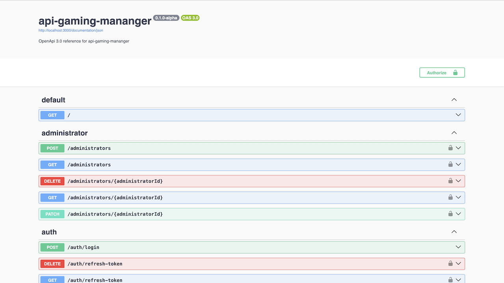
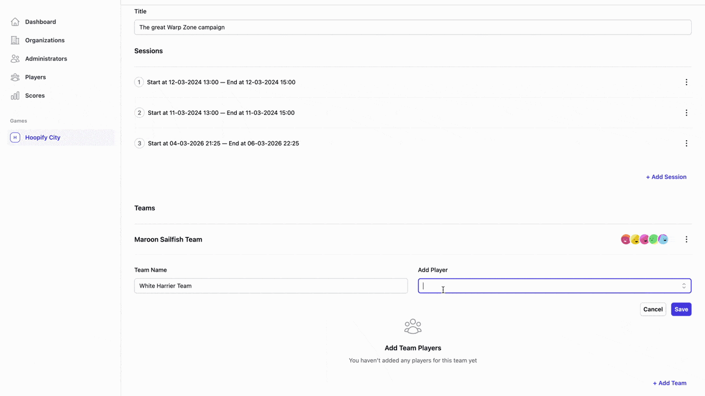
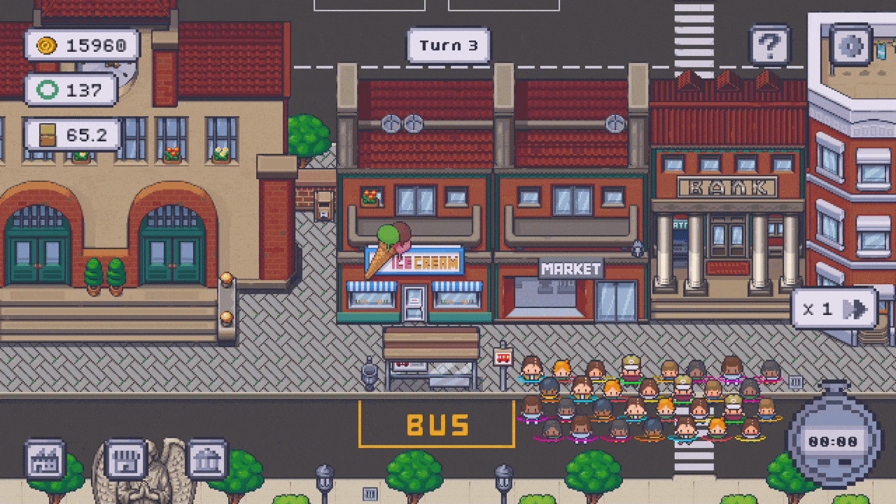

# Warpzone: a fictional game platform

This project represents a **fictional video game company** built around a subscription-based model.

The idea behind this “fantasy business” is simple: companies **subscribe** to the platform, create and manage their users (players, optionally organized into teams), configure **game campaigns**, and allow their users to participate in structured **game sessions**.

A campaign represents a configurable game experience (rules, match duration, structure), while sessions track actual player participation and activity within that campaign. The backend acts as the orchestration layer between business management and gameplay.

This monorepo includes:

- A [Backend API](#backend-api-fastify--mysql) to manage administrators, players, teams, campaigns, sessions, and authentication
- An [Admin panel](#admin-panel-react--tailwind-css) to manage campaigns, users, and teams
- A small [Game Client](#game-client-phaser-3) built with **Phaser 3**
- Multiple **shared libraries** (types, utilities, shared logic, etc.)
- Centralized configuration and tools across the stack

### Tech Stack Overview

- **Docker** for containerizing services and simplifying local development
- **Nx** for monorepo management and workspace orchestration
- **TypeScript** across the entire stack
- **Fastify** for the backend
- **JSON Schema** + **TypeBox** for validation and serialization
- **MySQL** as the database
- **Knex** for database queries and migrations
- **React** for the admin panel
- **Tailwind CSS** for UI styling
- **Phaser 3** for the game client
- **OpenAPI** for API documentation
- **JWT** for authentication

## Backend API (Fastify + MySQL)

Backend **REST API** application built using **Fastify** and **MySQL**.

It represents the core service consumed by both the admin panel and the game client. Through this API it is possible to:

- Manage administrators
- Manage players and teams
- Configure campaigns and matches
- Track game sessions and results
- Handle authentication and authorization

### Main Features

- Fast and lightweight server built with **Fastify**
- **JSON Schema** for validation and serialization using **TypeBox**
- Strongly typed request/response contracts
- **JWT authentication** with protected routes
- **MySQL** persistence layer
- **Knex** for database queries and migrations/versioning
- **OpenAPI documentation** for easier API exploration and integration
- **Nodemailer** integration for basic email sending workflows
- Modular structure aligned with Nx workspace boundaries

The backend acts as the single source of truth for business logic and shared domain models.

## Admin Panel (React + Tailwind CSS)

Admin panel application for internal platform management, built using **React** and **Tailwind CSS**.

It simulates the control panel that a subscribing company (or the platform owner) would use to manage its ecosystem: users, teams, and campaigns.

### Main Features

- Built with **React** and **Tailwind CSS**
- **React Router** for client-side navigation
- **Authentication flow** integrated with the backend (JWT-based)
- **Axios** as HTTP client for backend communication
- Reuses shared types and schemas from the backend via Nx libraries
- Clear separation between UI components and data access logic
- Modular and scalable folder structure

The admin panel focuses purely on business and organizational logic, without any direct gaming responsibility.

## Game Client (Phaser 3)

Small demo of a **pixel art game** built with **Phaser 3** called **Hoopify City**.

In this **management game**, you run _Hoopify_, a fictional hula-hoop company trying to grow its presence across the city. You manage production, balance resources, coordinate employees, invest in marketing, and optimize sales across different stores.

The objective is simple: build a profitable sustainable and profitable business by maximizing hula-hoop sales.

### Main Features

- Built with **Phaser 3** and **TypeScript**
- **WebGL** rendering with **Canvas** fallback
- Tilemap handling with multiple tilesets and layers
- Optimized real-time asset management (e.g. 9-slice scaling, object pooling)
- Basic **game state management**
- Interactive panels and UI buttons
- **Audio system** (music and sound effects)
- Sprite animations and scene transitions

It represents the “product” to which companies subscribe. The game integrates with the backend to authenticate players and associate gameplay activity with campaigns and sessions.

The goal is not to create a full production-ready game, but to demonstrate backend integration, shared types, and player-based game logic inside a monorepo architecture.

### Disclaimer

This was my first time building a game from scratch. I approached it as a technical challenge to understand the fundamentals of game loops, rendering, asset management, and client-backend integration.

I was not yet familiar with many common game development patterns at the beginning of the project, so some architectural decisions reflect a learning process rather than established best practices.

## Purpose of This Project

This repository is intended as:

- A **full-stack TypeScript architecture** example
- A practical demonstration of **Nx monorepo organization**
- A sandbox for experimenting with backend, frontend, and game development in a single unified workspace
- A showcase of cross-application **type sharing** and **domain-driven structure**

Although the business model is fictional, the architectural choices aim to reflect patterns that can be extended to real-world scenarios.

## Credits

Some of the visual and audio assets used in this project were created by talented independent artists.

Special thanks to:

- [**LimeZu**](https://limezu.itch.io/) – Tilesets, sprites and UI assets
- [**Rosaspuria**](https://www.behance.net/donatelladerosa) – Custom assets and sprites
- **Alex McCulloch** – Primary music theme
- **Juhani Junkala** – Secondary music theme
- **WobbleBoxx Workshop** - Sound effects
- **Owlishmedia** – Sound effects

The final game assets were customized and remixed by me.

## License

This project is licensed under the **GNU General Public License v3.0** **(GPL-3.0)**.

It is a portfolio and learning project, but you are free to use it, fork it, and build something bigger on top of it.

Just keep in mind that any derivative work must also be released under the same GPL-3.0 license. If you improve it, extend it, or turn it into something more ambitious, please keep it open and share it back with the community.

You can find the full license text in the [LICENSE](./LICENSE) file.
